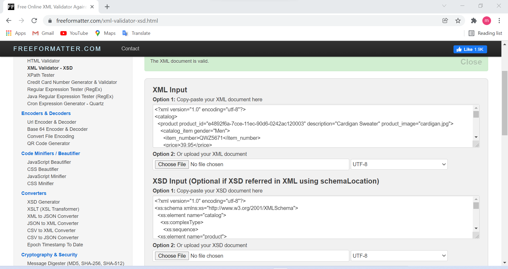
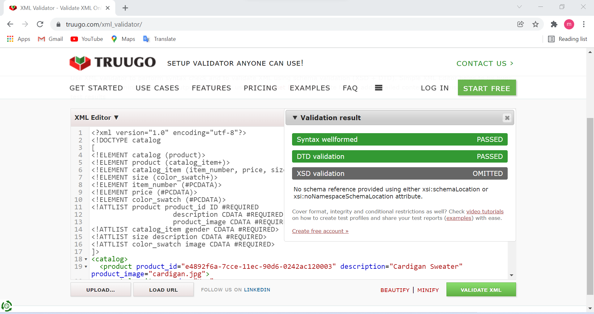

# Assignment 2
1. DTD validation
 
2. XSD validation
 
3. I personally feel that XSD declaration is more effective than DTD declaration.
One can easily understand and read the XSD file, while DTD file could be a little confusing as it require more knowledge and understanding syntax and everything.
XSD file has some easy and simple syntax which evertyone can learn faster than the other one.
so i personally prefer XSD over DTD.
